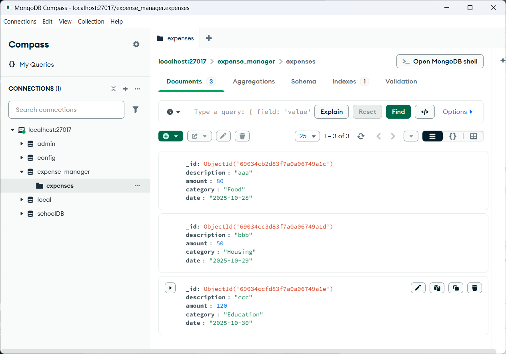
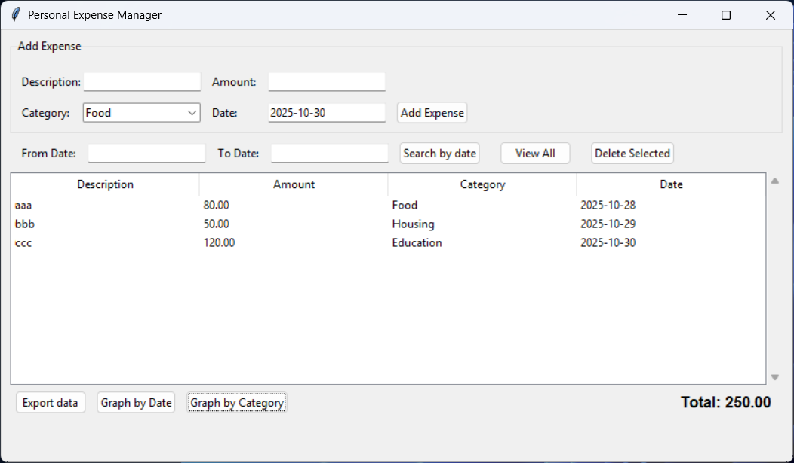
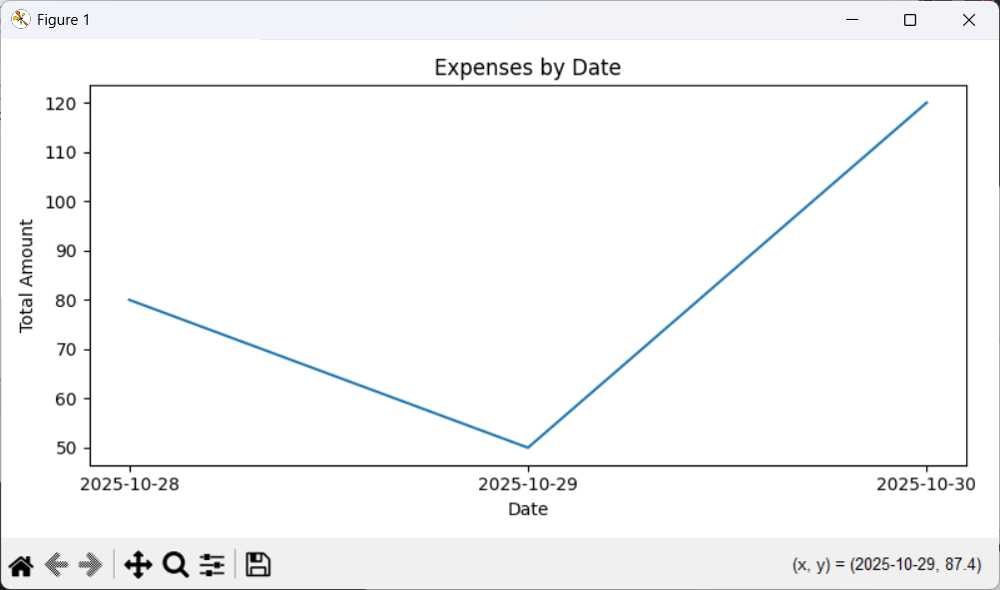
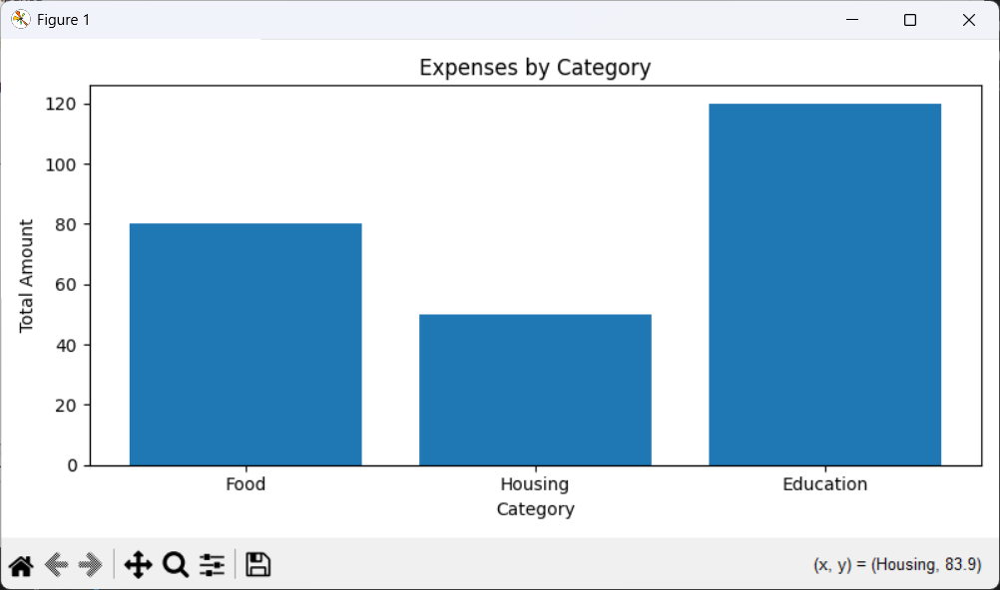
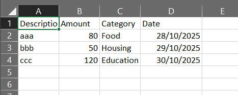

# Advanced-Expense-Tracker

## Database (MongoDB)
- All expense records are stored in MongoDB using PyMongo library operations.
```python
from pymongo import MongoClient
```
- connect to MongoDB using:
```python
self.client = MongoClient("mongodb://localhost:27017")
self.db = self.client["expense_manager"]
self.col = self.db["expenses"]
```

- Each document in the database follows this structure
```python
{
"description": str,
"amount": float,
"category": str,
"date": "YYYY-MM-DD"
}
```


## Graphical User Interface: 
built with Tkinter library and organized in frames:
```python
import tkinter as tk
from tkinter import ttk, messagebox, filedialog
```
- Input Frame: for adding new expenses (description, amount, category, date).
- Search Frame: for searching by date range, and deleting records.
- Treeview Frame: to display stored expenses.
- Bottom Frame: for export, graph generation, and total display.



## Expense Operations
- add_expense(): collects data from input fields, validates it, and inserts a new document into MongoDB. using insert_one()
- load_records(): retrieves all expenses and refreshes the Treeview table. using find()
- search_by_date(): allowing users to filter expenses between two selected dates. Using $gte and $lte
- delete_selected(): removes selected records from both MongoDB and the Treeview. Using delete_one()
- export_data(): writes displayed records into a CSV file. Using CSV library.
- graph_by_date(): shows a line plot of total expenses per date.
- graph_by_category(): shows a bar chart of total expenses per category.
- update_total(): updates automatically after every search or database operation.

# Graph by date:
```python
plt.plot(dates, amounts)
```


# Graph by category:
```python
plt.bar(cats, amounts)
```


# Export CSV:
```python
with open(fpath, "w", newline='', encoding='utf-8') as f:
writer = csv.writer(f)
writer.writerow(["Description", "Amount", "Category", "Date"])
```


